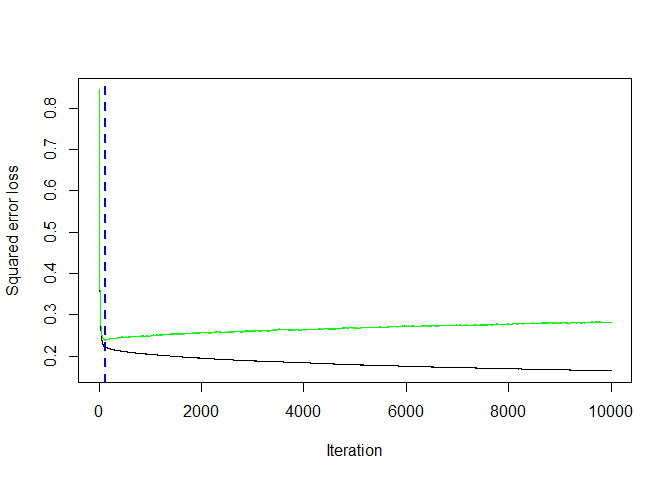

Medical Insurance Regression
================
Denise O’Sullivan

This notebook will explore what the best machine learning technique is
to predict one’s medical insurance cost based on personal attributes.

**Data Source:** <https://www.kaggle.com/mirichoi0218/insurance>

Techniques used here are:

  - 
  - 
### Load Libraries

``` r
library(ggplot2)        # for plotting
library(corrplot)       # for correlation matrix
library(dplyr)
library(tidyr)
library(rpart)          # decision tree
library(randomForest)   # random forest
library(gbm)
library(xgboost)
library(ipred)
```

``` r
insurance = read.csv('https://raw.githubusercontent.com/stedy/Machine-Learning-with-R-datasets/master/insurance.csv',
                     stringsAsFactors = TRUE)
```

### Data Exploration

``` r
ggplot(data = insurance, aes(x=charges)) +
  geom_histogram() +
  labs(title = 'Distribution of outcome variable: Medical Charges') +
  theme_minimal() +
  theme(plot.title = element_text(hjust=0.5))
```

<!-- -->

The outcome variable is right skewed.

``` r
sapply(insurance, function(x) sum(is.na(x)))
```

    ##      age      sex      bmi children   smoker   region  charges 
    ##        0        0        0        0        0        0        0

No NA’s so don’t to clean the data for this.

``` r
select_if(insurance, is.numeric) %>% cor()
```

    ##                age       bmi   children    charges
    ## age      1.0000000 0.1092719 0.04246900 0.29900819
    ## bmi      0.1092719 1.0000000 0.01275890 0.19834097
    ## children 0.0424690 0.0127589 1.00000000 0.06799823
    ## charges  0.2990082 0.1983410 0.06799823 1.00000000

None of the numeric variables are highly correlated with charges.

``` r
select_if(insurance, is.numeric) %>% 
  gather() %>%
  ggplot() +
  geom_histogram(aes(x=value), bins=10) + 
  facet_wrap(~key, scale='free')
```

<!-- -->

bmi is normally distributed whereas all other variables are right
skewed. The majority of people are in their 20s and have no children.

``` r
select_if(insurance, is.factor) %>% 
  gather() %>%
  ggplot() +
  geom_histogram(aes(x=value), stat='count') + 
  facet_wrap(~key, scale='free')
```

<!-- -->

There is an equal amount of males and females and the distribution of
region is also quite evenly divided. The majority of people are
non-smokers.

### Data Preparation

Now the data needs to be split into a train and test set before training
the model. Training dataset will be made of 70% of the data and the
other 30% will be used to test the model.

``` r
scaled_insurance = insurance %>% mutate(charges=scale(charges))
n_train <- floor(nrow(insurance) * 0.7)
train_rows <- sample(nrow(insurance), n_train)
train_set <- scaled_insurance[train_rows,]
test_set <- scaled_insurance[-train_rows,]

ggplot(data = train_set, aes(x=charges)) +
  geom_histogram() +
  labs(title = 'Training Set outcome variable: Medical Charges (Scaled)') +
  theme_minimal() +
  theme(plot.title = element_text(hjust=0.5))
```

<!-- -->

``` r
ggplot(data = test_set, aes(x=charges)) +
  geom_histogram() +
  labs(title = 'Test Set outcome variable: Medical Charges (Scaled)') +
  theme_minimal() +
  theme(plot.title = element_text(hjust=0.5))
```

<!-- -->

The metric we will use to measure the accuracy of the model is Mean
Squared Prediction Error (MSPE). We want the MSPE to be low as this
would indicate there is a small difference between the predicted values
and the actual values.

First we will look at a decision tree as a modelling technique.

``` r
tree <- rpart(charges~., data=train_set)
plot(tree)
text(tree)
```

<!-- -->

``` r
predtree <- predict(tree, test_set)
mean((test_set$charges - predtree)^2)
```

    ## [1] 0.1495559

``` r
rf <- randomForest(charges~., data=train_set, ntree=5000,mtry=5, nodesize=20)
pred_rf <- predict(rf, test_set)
mean((test_set$charges - pred_rf)^2)
```

    ## [1] 0.1199915

Next, random forest which performs better than the decision tree.

``` r
gbm_model<- gbm(charges~., data=train_set, distribution="gaussian",
               n.trees=10000, cv.folds = 10)

best_iter <- gbm.perf(gbm_model, method="cv")
```

<!-- -->

``` r
gbm_pred <- predict(gbm_model, test_set, best_iter)
mean((test_set$charges - gbm_pred)^2)
```

    ## [1] 0.2224562

Boosting is much worse than random forest\!

``` r
# XG BOost
xgb_data = as(as.matrix(scaled_insurance), "dgCMatrix")

train_xgb <- xgb_data[train_rows,]
test_xgb <- xgb_data[-train_rows,]
params <- list("objective" = "reg:linear",
               "eval_metric" = "rmse")

# Cross validation to find the best iterator
xgbcv<- xgb.cv(params = params, data = train_xgb[,-which(colnames(train_xgb)=='charges')],
                label=train_xgb[,'charges'],
                nrounds = 300,
                nfold=5,
                print_every_n = 20,
                verbose=FALSE, 
                prediction = TRUE)
```

    ## [03:42:34] WARNING: amalgamation/../src/objective/regression_obj.cu:171: reg:linear is now deprecated in favor of reg:squarederror.
    ## [03:42:34] WARNING: amalgamation/../src/objective/regression_obj.cu:171: reg:linear is now deprecated in favor of reg:squarederror.
    ## [03:42:34] WARNING: amalgamation/../src/objective/regression_obj.cu:171: reg:linear is now deprecated in favor of reg:squarederror.
    ## [03:42:34] WARNING: amalgamation/../src/objective/regression_obj.cu:171: reg:linear is now deprecated in favor of reg:squarederror.
    ## [03:42:34] WARNING: amalgamation/../src/objective/regression_obj.cu:171: reg:linear is now deprecated in favor of reg:squarederror.

``` r
best_iter = which.min(xgbcv$evaluation_log[, test_rmse_mean])
gbmfit <- xgboost(data=train_xgb[,-which(colnames(train_xgb)=='charges')], 
                  silent=0,
                  label = train_xgb[,'charges'], 
                  nrounds=best_iter,
                  verbose=0, 
                  objective="reg:linear")
```

    ## [03:42:37] WARNING: amalgamation/../src/objective/regression_obj.cu:171: reg:linear is now deprecated in favor of reg:squarederror.
    ## [03:42:37] WARNING: amalgamation/../src/learner.cc:573: 
    ## Parameters: { "silent" } might not be used.
    ## 
    ##   This may not be accurate due to some parameters are only used in language bindings but
    ##   passed down to XGBoost core.  Or some parameters are not used but slip through this
    ##   verification. Please open an issue if you find above cases.

``` r
pred_xgb <- predict(gbmfit, test_xgb[,-which(colnames(train_xgb)=='charges')])
mean((test_xgb[,'charges'] - pred_xgb)^2)
```

    ## [1] 0.9734975

Very bad result compared to others - this would be because dcgMatrix
removed categorical variables so need to dummy variable these.

``` r
bag <- bagging(charges~.,data=train_set,coob=TRUE,nbagg=700)
bag_pred <- predict(bag, test_set)
mean((test_set$charges - bag_pred)^2)
```

    ## [1] 0.1351028

Bagging is slightly better than random forest.
